# Los Cuadros de Rita 🎨

**E-commerce para la Artista Peruana Rita Cam**

Un proyecto real de tienda online que sirve como galería de exposición y venta de cuadros, desarrollado con PHP7, MySQL y Bootstrap 5.

## 📸 Galería del Proyecto

### 🏠 **Página Principal**

  
  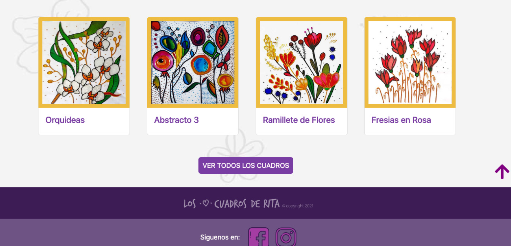

### 🛒 **Sistema de Compras**

  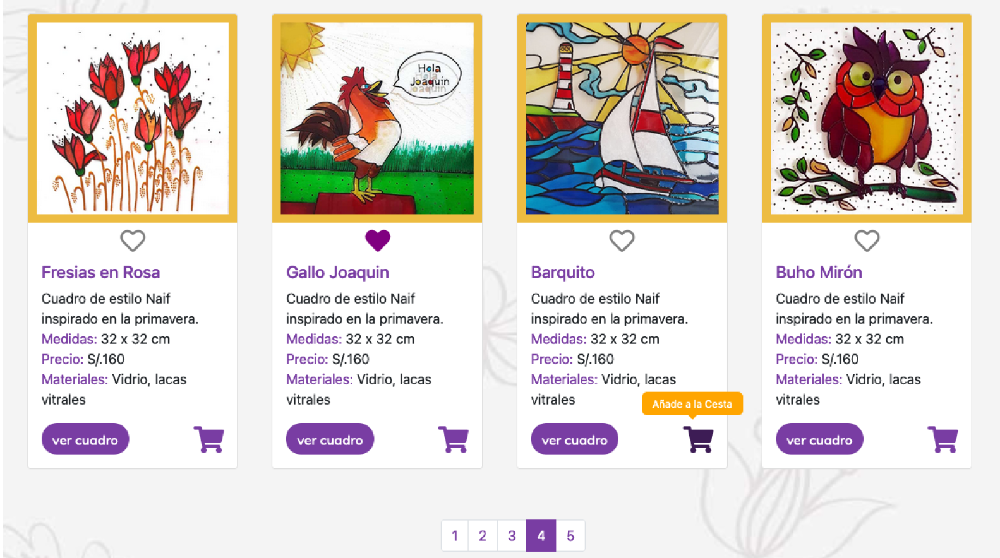
  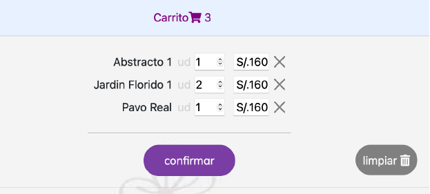

### 👤 **Sistema de Usuario**

  
  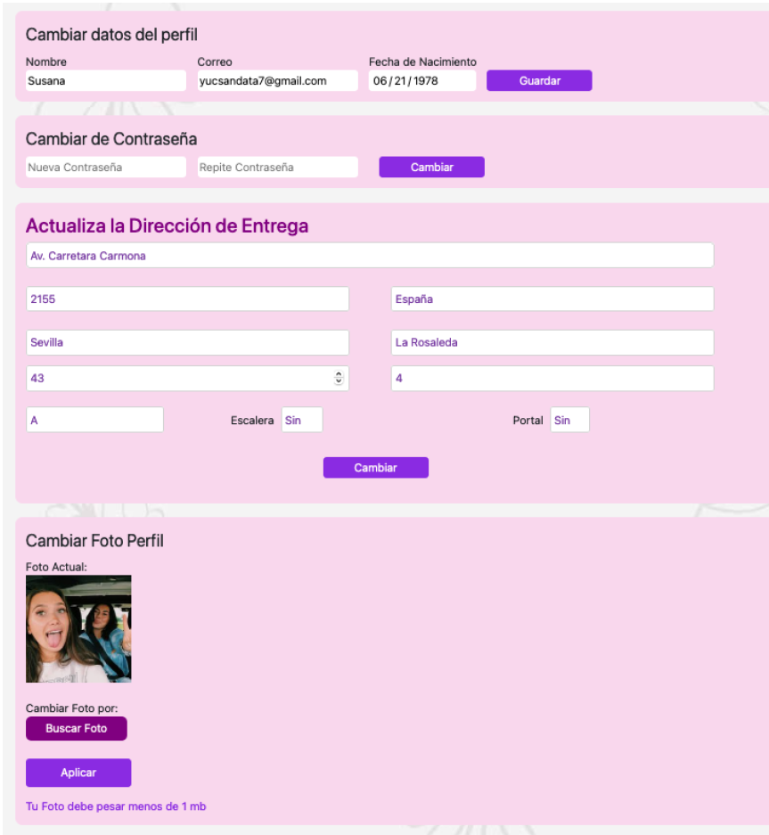

### 🎨 **Vista de Producto**

  

### 🛡️ **Panel de Administración**

  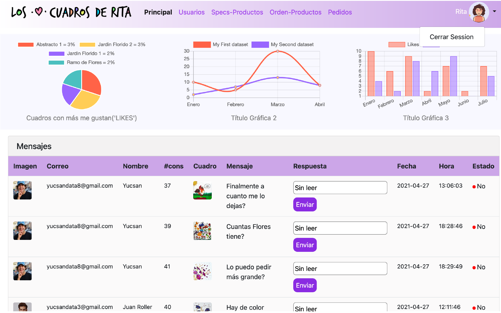
  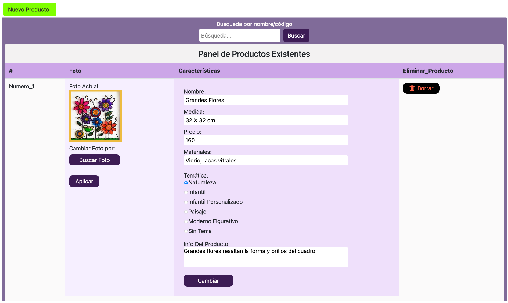

  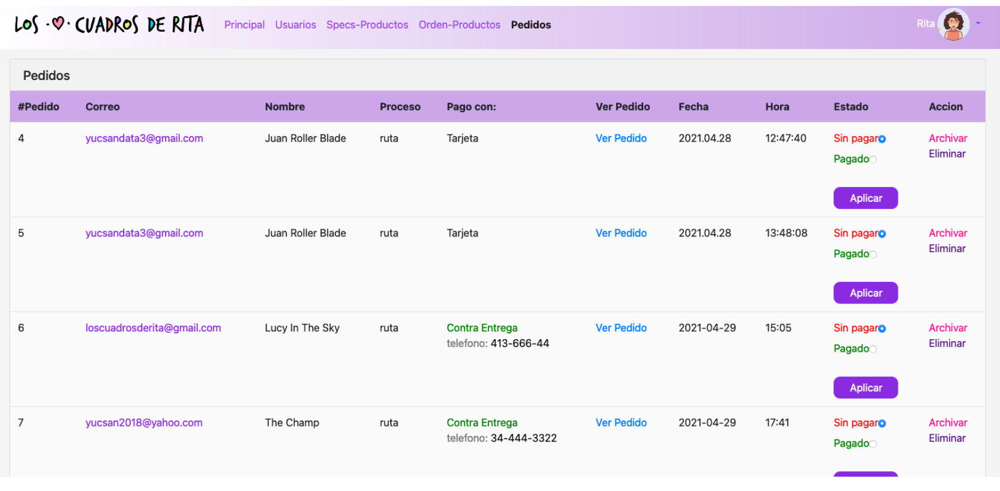

### 📱 **Diseño Responsive**

  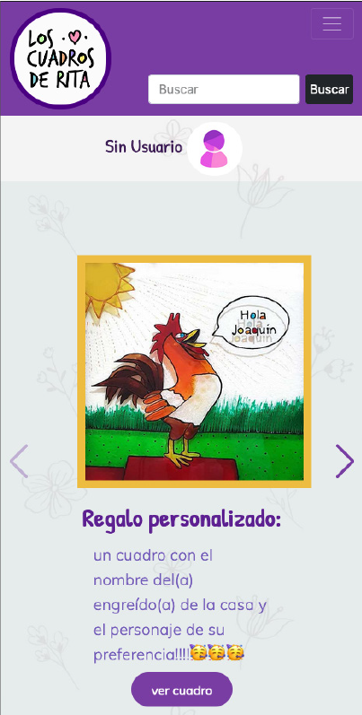

---

## 📋 Descripción del Proyecto

Este proyecto consiste en un e-commerce completo para la artista peruana Rita Cam, donde se puede conocer sobre la artista y funciona como galería de exposición y venta de sus obras de arte.

### 🔗 Repositorio
**URL:** https://github.com/Yucsan/PHP_Web_Tienda_Rita

### 👨‍💻 Desarrollador
**Fernando Yucsan Chang Cam**  
*Módulo: Desarrollo Backend con PHP7 y MySQL*

## 🚀 Características Principales

### **Frontend**
- ✅ Diseño responsive con Bootstrap 5
- ✅ Slider principal dinámico con Swiper.js
- ✅ Sistema de búsqueda funcional
- ✅ Carrito de compras con JavaScript y SessionStorage
- ✅ Sistema de "Me Gusta" con fetch API
- ✅ Registro y login de usuarios
- ✅ Recuperación de contraseñas
- ✅ Perfil de usuario editable
- ✅ Sistema de mensajes/comentarios
- ✅ Paginación dinámica
- ✅ Proceso completo de compra

### **Backend/Dashboard**
- ✅ Panel de administración completo
- ✅ Gestión de usuarios (CRUD)
- ✅ Gestión de productos (CRUD)
- ✅ Sistema de ordenamiento visual de productos (Drag & Drop)
- ✅ Gestión de pedidos
- ✅ Sistema de mensajes
- ✅ Gráficos con Chart.js
- ✅ Validaciones y seguridad

## 🛠️ Tecnologías Utilizadas

### **Frontend**
- **HTML5 & CSS3**
- **Bootstrap 5 Beta**
- **JavaScript ES6**
- **Swiper.js** - Slider principal
- **SweetAlert2** - Alertas personalizadas

### **Backend**
- **PHP 7**
- **MySQL**
- **Bootstrap 4.6** (Dashboard)
- **jQuery & jQuery UI**
- **Chart.js** - Gráficos estadísticos

### **Funcionalidades JavaScript**
- Fetch API para likes y eliminaciones
- SessionStorage para carrito de compras
- jQuery UI Sortable para ordenamiento
- Validaciones en tiempo real

## 📱 Funcionalidades Detalladas

<table>
  <tr>
    <td width="60%" valign="top">
      <h3>🔐 Sistema de Usuario</h3>
      <ul>
        <li><strong>Registro simplificado</strong>: Solo datos esenciales + verificación por email</li>
        <li><strong>Login con recordar sesión</strong>: Cookie de 2 años</li>
        <li><strong>Recuperación de contraseña</strong>: Vía email con enlaces únicos</li>
        <li><strong>Perfil editable</strong>: Cambio de datos, foto, contraseña y dirección</li>
      </ul>
    </td>
    <td width="40%" valign="top" align="center">
      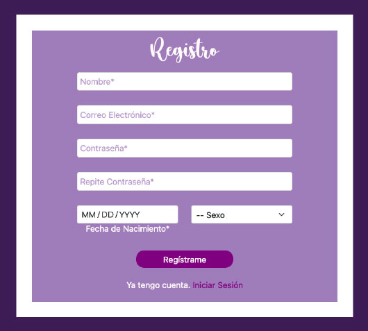
    </td>
  </tr>
</table>
 
<table>
  <tr>
    <td width="60%" valign="top">
      <h3>🛒 Carrito de Compras</h3>
      <ul>
        <li><strong>Gestión con JavaScript</strong>: Añadir/eliminar productos dinámicamente</li>
        <li><strong>Persistencia</strong>: SessionStorage para navegación entre páginas</li>
        <li><strong>Validaciones</strong>: No permite cantidades negativas</li>
        <li><strong>Pedidos guardados</strong>: Sistema de guardado automático</li>
      </ul>
    </td>
    <td width="40%" valign="top" align="center">
      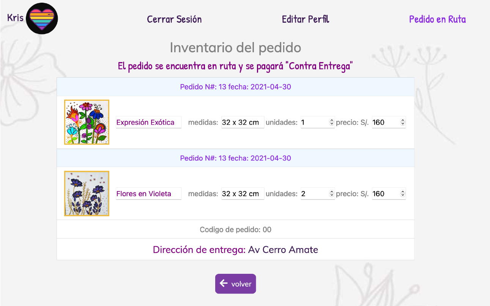
    </td>
  </tr>
</table>
 
<table>
  <tr>
    <td width="60%" valign="top">
      <h3>❤️ Sistema de Likes</h3>
      <ul>
        <li><strong>Funcionalidad real</strong>: Conectado a base de datos vía fetch API</li>
        <li><strong>Filtrado inteligente</strong>: Usando <code>array_key_exists</code></li>
        <li><strong>Solo usuarios logueados</strong>: LocalStorage para usuarios no registrados</li>
        <li><strong>Tiempo real</strong>: Actualización inmediata sin recargar página</li>
      </ul>
    </td>
    <td width="40%" valign="top" align="center">
      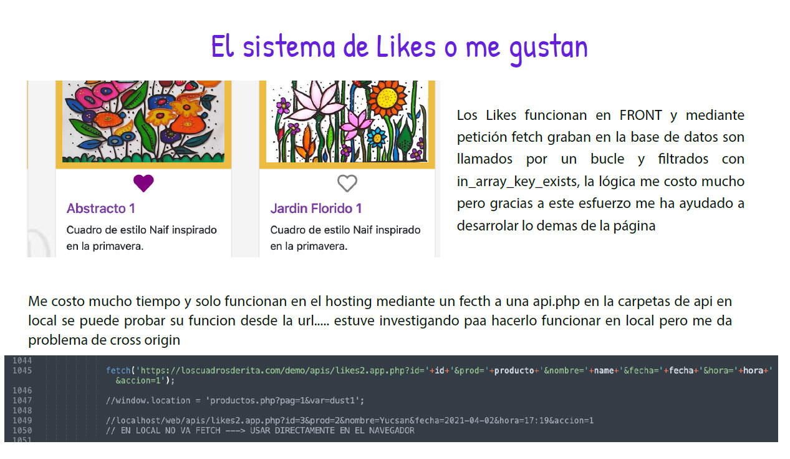
    </td>
  </tr>
</table>
 
<table>
  <tr>
    <td width="60%" valign="top">
      <h3>💳 Proceso de Compra</h3>
      <ul>
        <li><strong>Dirección dinámica</strong>: Solo solicita dirección al momento de compra</li>
        <li><strong>Métodos de pago</strong>: Tarjeta (simulado) y contra entrega</li>
        <li><strong>Confirmaciones</strong>: Email automático al finalizar pedido</li>
        <li><strong>Estados de pedido</strong>: Guardado, en ruta, pagado</li>
      </ul>
    </td>
    <td width="40%" valign="top" align="center">
      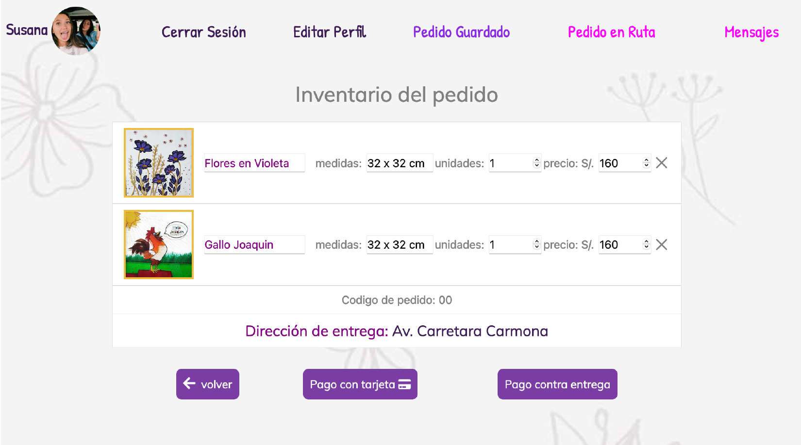
    </td>
  </tr>
</table>
 
<table>
  <tr>
    <td width="60%" valign="top">
      <h3>🛡️ Panel de Administración</h3>
      <ul>
        <li><strong>Dashboard estadístico</strong>: Gráficos de productos más gustados</li>
        <li><strong>Gestión completa de usuarios</strong>: Activar/desactivar cuentas</li>
        <li><strong>Ordenamiento visual</strong>: Drag & drop para orden de productos</li>
        <li><strong>Gestión de mensajes</strong>: Responder consultas de usuarios</li>
      </ul>
    </td>
    <td width="40%" valign="top" align="center">
      
    </td>
  </tr>
</table>

## 🗄️ Estructura de Base de Datos

<table>
  <tr>
    <td width="60%" valign="top">
      
El proyecto incluye múltiples tablas para:

      <ul>
        <li><strong>Usuarios</strong>: Datos personales, direcciones, estados</li>
        <li><strong>Productos</strong>: Información completa, orden personalizable</li>
        <li><strong>Pedidos</strong>: Historial completo de compras</li>
        <li><strong>Likes</strong>: Sistema de favoritos por usuario</li>
        <li><strong>Mensajes</strong>: Chat/consultas sobre productos</li>
        <li><strong>Contenido</strong>: Biografía y textos dinámicos</li>
      </ul>
    </td>
    <td width="40%" valign="top" align="center">
      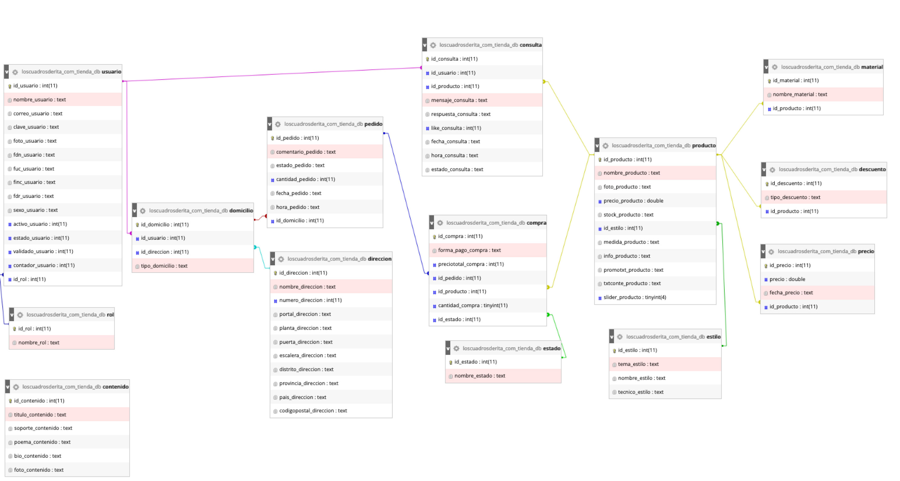
    </td>
  </tr>
</table>

## 🎯 Características Destacadas

### **🎨 Vista Previa Rápida**
| Característica | Imagen | Descripción |
|---------------|---------|-------------|
| **Slider Dinámico** |  | Slider principal con contenido dinámico desde BD |
| **Sistema de Likes** |  | Favoritos en tiempo real con fetch API |
| **Carrito Inteligente** |  | Gestión completa con SessionStorage |
| **Drag & Drop Admin** |  | Ordenamiento visual de productos |

### **Paginación Dinámica**
- Cálculo automático de páginas (8 productos por página)
- Navegación responsive
- Búsqueda integrada con paginación

### **Sistema de Ordenamiento**
- **Drag & Drop**: jQuery UI Sortable
- **Actualización en tiempo real**: Modifica orden sin afectar funcionalidades
- **Responsive**: Compatible con móviles (jQuery UI Touch Punch)

### **Responsive Design**
- Diseño adaptativo para todos los dispositivos
- Menús responsive
- Carrito optimizado para móviles

## 🔧 Instalación y Configuración

<strong>📋 Ver Instrucciones Detalladas</strong>

### **Requisitos**
- PHP 7.0 o superior
- MySQL 5.7 o superior
- Servidor web (Apache/Nginx)
- Extensiones PHP: mysqli, mail

### **Configuración**
1. Clonar el repositorio
2. Configurar base de datos en archivos de conexión
3. Importar estructura de base de datos
4. Configurar servidor de correo para envío de emails
5. Ajustar rutas en archivos de configuración

### **Capturas de Configuración**

  
  

### **Notas de Desarrollo**
- **Likes funcionales**: Solo en hosting (problema de CORS en local)
- **URL local configurada**: Línea 1049 en productos.php
- **SweetAlert2**: Incluido vía include() para alertas tempranas

## 📊 Estado del Proyecto

### **✅ Completado**
- Frontend completo y funcional
- Sistema de usuarios y autenticación
- Carrito de compras operativo
- Panel de administración
- Proceso de compra (excepto pasarela real)
- Sistema de likes y mensajes

### **🔄 En Desarrollo**
- Panel de control para contenido del slider
- Edición dinámica de textos "Sobre Mí"
- Mejoras de CSS para dispositivos pequeños
- Integración de Stripe para pagos

### **🎯 Próximas Mejoras**
- Personalización completa de alertas SweetAlert2
- Optimización de responsive design
- Implementación de pasarela de pagos real
- Mejoras de seguridad en formularios

## 📝 Notas del Desarrollador

*"Considero que el proyecto está ya funcional. Lo que más me enorgullece es el sistema de ordenamiento visual de productos, que permite cambiar el orden de visualización simplemente arrastrando y soltando, manteniendo todas las funcionalidades intactas."*

**Fernando Chang**

---

## 📞 Contacto

Para consultas sobre el proyecto o colaboraciones, contactar a través del repositorio de GitHub.

**¡Gracias por revisar Los Cuadros de Rita!** 🎨✨
